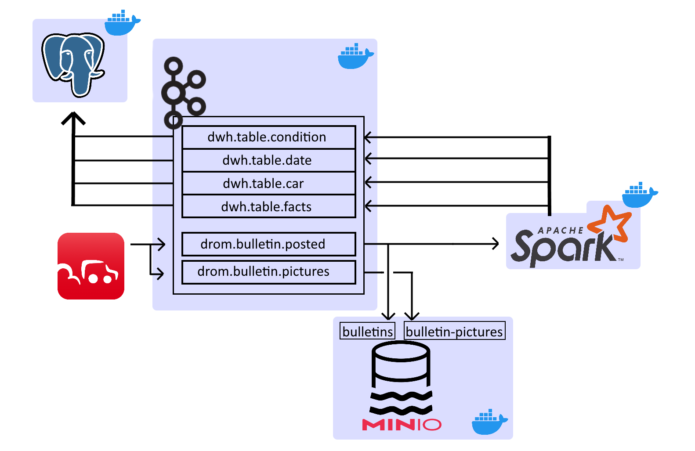
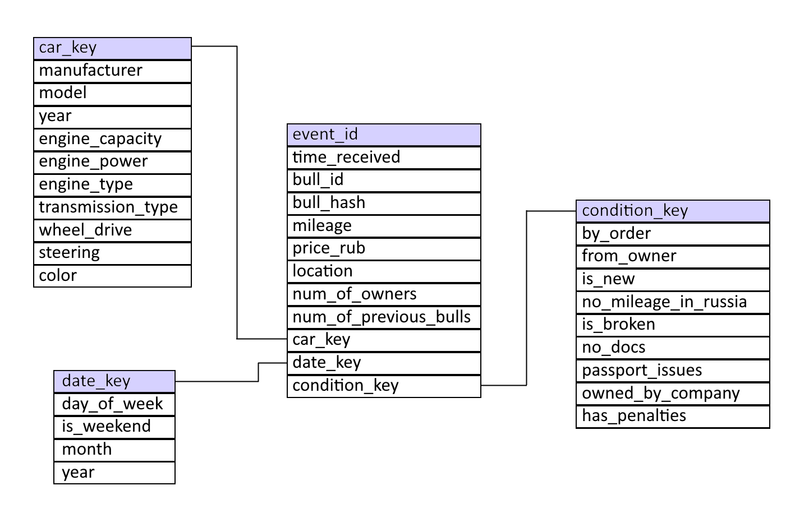
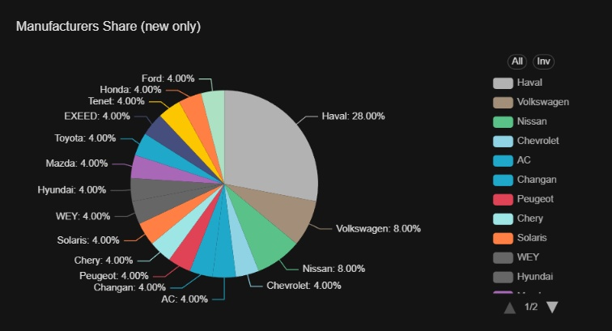
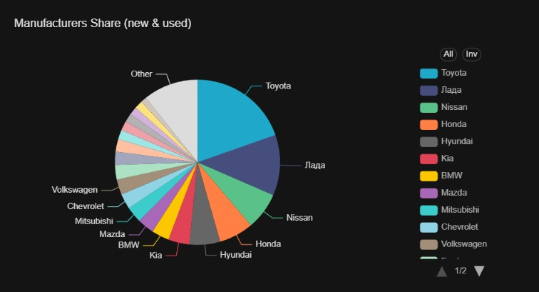
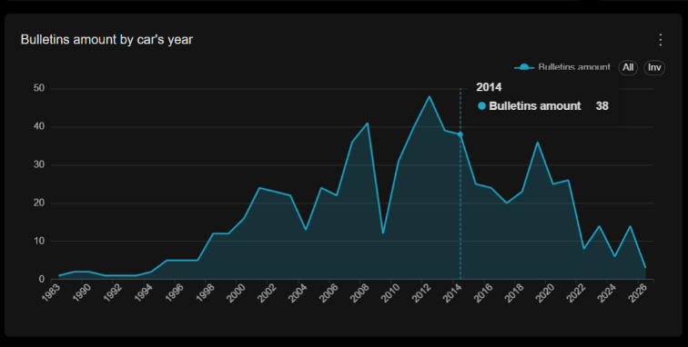

# Data pipeline для объявлений с Drom.ru


**ETL & ELT** процессы, включающие парсинг, обработку, хранение данных об объявлениях о продаже авто на [drom.ru](https://auto.drom.ru) в Data Warehouse и Datalake, а также формирование на их основе аналитических дашбордов
---


---

##  Technical features

- **End-to-end realtime ETL & ELT**: парсинг -> загрузка в Datalake/преобразование -> загрузка в DWH -> аналитические дашборды;
- **Преобразование данных к Star Schema**: для быстрой аналитики;
- **Защита от дубликатов**: Kafka KRaft кластер с репликами для отказоустойчивости, idempotent producer; кастомные Kafka consumer с ручным управлением коммитами;
- **История изменений**: объявления, повторно опубликованные с изменениями, сохраняются как новая запись в DWH;
- **Контейнеризация**: быстрое развертывание через docker-compose.

---

## Cтек

| Этап | Инструмент|
|--------|------------|
| **Источник данных** | Python скрапер & парсер|
| **Обработка** | PySpark Structured Streaming |
| **Брокер сообщений** | Apache Kafka KRAFT кластер |
| **DWH** | PostgreSQL |
| **Datalake** | MinIO (сырые данные: jpg изображения, json) |
| **Контейнеризация** | Docker Compose |
| **Мониторинг** | MinIO UI, pgAdmin 4 |
| **Аналитика** | Apache Superset |
| **Алертинг** | WIP |

---

## Структура данных DWH



### Таблица фактов
- `bulls fact`
  - `event_id` (BIGINT) — автоинкремент
  - `bull_id` (TEXT) — ID объявления
  - `bull_hash` (BIGINT) — хэш от изменяемых полей
  - `car_key`, `date_key`, `condition_key` (BIGINT) — внешние ключи к таблицам измерений
  - `price_rub`, `mileage`, `location`, `num_of_owners`, `num_of_previous_bulls` — изменяемые поля

### Таблицы измерений
- `dim_car` — характеристики авто (`manufacturer`, `model`, `engine_capacity`, `color`, ...)
- `dim_date` — дата публикации (`year`, `month`, `is_weekend`, ...)
- `dim_condition` — BOOLEAN значения флагов состояния (`broken`, `no_docs`, `owned_by_company`, `has_penalties`, ...)

---

## Запуск
### Требования
1. Docker 
2. Python 3
---
### Шаги
1. **Клонировать репозиторий**
   ```bash
   git clone https://github.com/egor951769794/drom-datapipeline.git
В директории **drom-dwh**:
   
 2. **Запустить docker контейнеры**
	 ```bash
	   docker-compose --profile "*" up --build
2. **Запустить источник данных**
	```bash
	   .venv\Scripts\activate
	   pip install -r requirements.txt
	   python ./data-extraction/main.py --region Омск --start-page 12 --verbose
Параметры:
- ```--region``` -- регион (город, область) поиска объявлений
- ```--start-page``` -- страница, с которой начать поиск новых объявлений
- ```--verbose``` -- включить подробные логи
- ```--mode [live - по умолчанию/hisotrical]``` -- режим поиска (только новые записи/собирать исторические данные)

4. **Доступ к данным**
	- MinIO Datalake доступен по `localhost:9091`; логин `dev_admin`, пароль `dev_password`;
	- pgAdmin доступен по `localhost:8080`, авторизация через логин `user@postgres.com`, пароль `pwd`, подключение к БД `dwh` — по порту `5432` через пользователя `user` пароль `pwd`;
	- Superset доступен по ```localhost:8088```, логин ```admin``` пароль ```admin```.

>**Important note**: конфигурация города для поиска объявлений (```--region```) осуществляется посредством редактирования словаря `REGIONS` в `drom-dwh/data-extraction/misc/constants.py`

## Аналитика
Apache Superset
---






---

## Future Plans
- внедрение ML-моделей для предсказания ключевых параметров;
- алертинг;
- подключение дополнительных источников данных.
